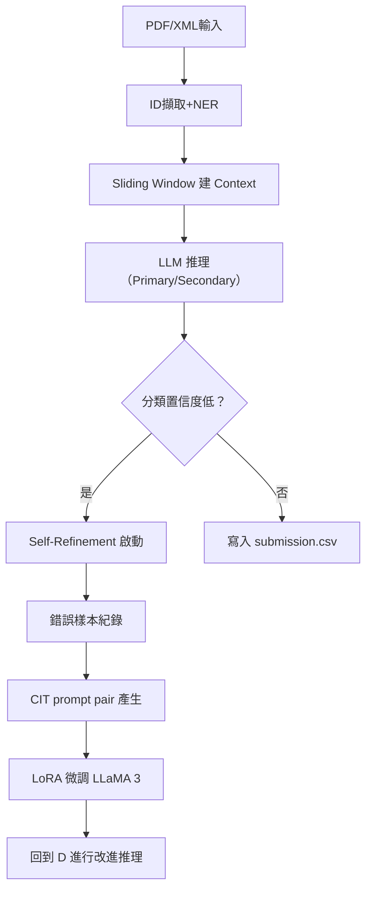

# Make Data Count + LLaMA 3

本專案專為 Kaggle 的 Make Data Count 比賽設計，使用 LLaMA 3 8B Instruct 為核心模型，整合 Self-Evolving Learning (SEL) 四大模組進行文獻資料引用分類。

📌 開發目標：
- 輸入格式：PDF / XML
- 輸出格式：submission.csv
- Leaderboard > 0.910 分數

📁 專案結構對應：
- L1–L3：預處理與基礎推理
- L4–L5：精煉與再訓練（Self-Refinement + Meta-Cog）
- L6–L7：記憶檢索與結果產出驗證

