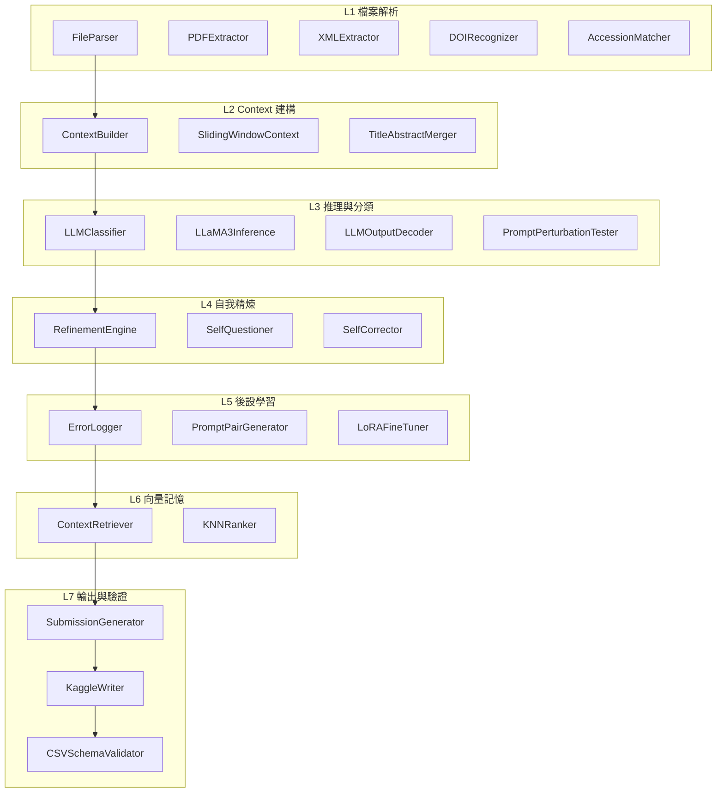

# Make Data Count + LLaMA 3

本專案專為 Kaggle 的 Make Data Count 比賽設計，使用 LLaMA 3 8B Instruct 為核心模型，整合 Self-Evolving Learning (SEL) 四大模組進行文獻資料引用分類。

📌 開發目標：
- 輸入格式：PDF / XML
- 輸出格式：submission.csv
- Leaderboard > 0.910 分數

📁 專案結構：

```
make-data-count-llama/
├── data/
│   ├── raw/                 ← PDF, XML 原始檔案
│   ├── context/             ← context_unit 輸出
│   ├── predictions/         ← 分類結果 / 修正結果
│   ├── errors/              ← 錯誤樣本與精煉記錄
│   ├── cit_pairs/           ← CIT 訓練資料（prompt pairs）
│   ├── rat_memory/          ← 向量索引與語境資料
│   └── submission/          ← CSV 輸出與驗證報告
├── models/
│   ├── llama-3-8b-instruct/ ← 主模型與 tokenizer
│   └── lora_adapters/       ← LoRA 訓練儲存
├── utils/
│   ├── parser/              ← L1
│   ├── context_builder/     ← L2
│   ├── llm_inference/       ← L3
│   ├── refinement/          ← L4
│   ├── meta_cognition/      ← L5
│   ├── retriever/           ← L6
│   └── submission_writer/   ← L7
├── notebooks/
│   └── 01~07_xxx_test.ipynb ← 各層級模組測試與展示
└── README.md
```



## Kaggle Notebook 部署指南

1. 建立 Kaggle Notebook，clone repo(確認repo切換到public)。
   ```bash
   !git clone https://github.com/Danwuoo/make-data-count-llama.git
   ```
2. 安裝依賴項。
   ```bash
   !pip install -r /kaggle/working/make-data-count-llama/requirements.txt
   ```
   此時會看到報錯，輸入:
   ```bash
   !pip install "scipy>=1.10"
   ```
4. 接下來把訓練用的資料抓到/data/raw/。
   ```python
   import shutil
   import os
   
   # 原始資料夾
   pdf_dir = "/kaggle/input/make-data-count-finding-data-references/train/PDF"
   xml_dir = "/kaggle/input/make-data-count-finding-data-references/train/XML"
   
   # 目標資料夾（統一放在 raw 目錄下）
   raw_dir = "/kaggle/working/make-data-count-llama/data/raw"
   os.makedirs(raw_dir, exist_ok=True)
   
   # 複製 PDF
   for file in os.listdir(pdf_dir):
    src = os.path.join(pdf_dir, file)
    dst = os.path.join(raw_dir, file)
    shutil.copy(src, dst)
   
   # 複製 XML
   for file in os.listdir(xml_dir):
    src = os.path.join(xml_dir, file)
    dst = os.path.join(raw_dir, file)
    shutil.copy(src, dst)
    ```
